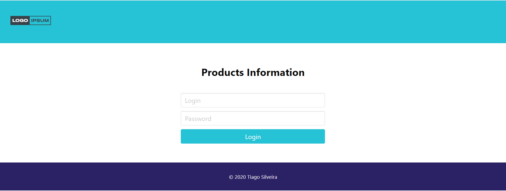
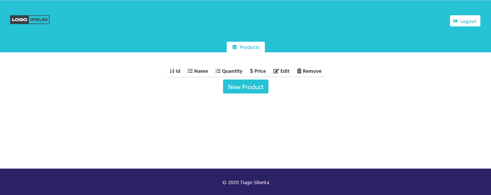
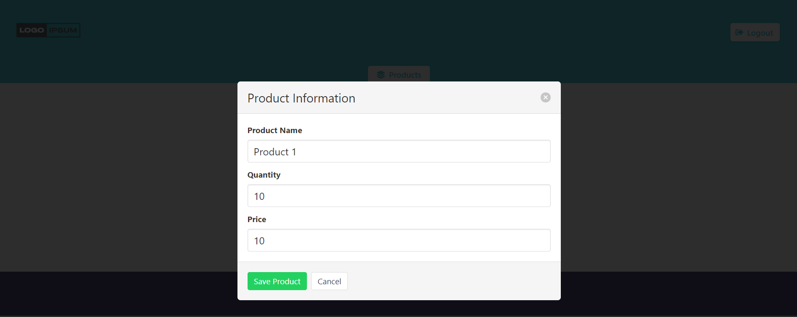
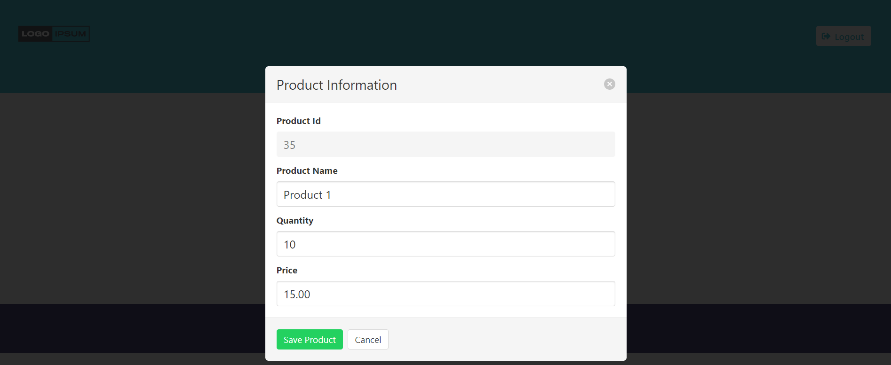
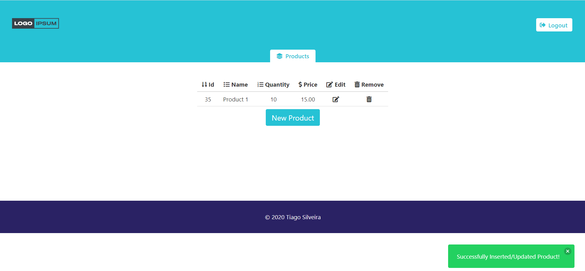
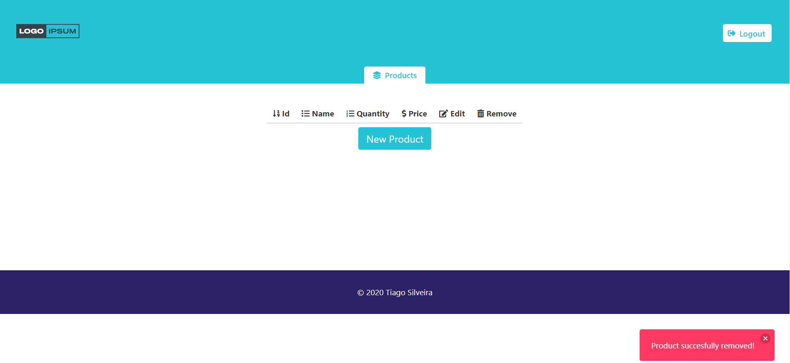

## Description

This is a ReactJs Frontend to access the NodeJs Backend

## Requirements

```bash
brew install node@10.16.0
```

## Dependencies

Install dependencies with:

```bash
cd frontend
npm install
```

### Running the UI

Run the UI with:

```bash
cd frontend
npm start
```

### Main Screen (Login)


### Products Screen


### Inserting a Product



### Editing a Product



### Removing a Product



